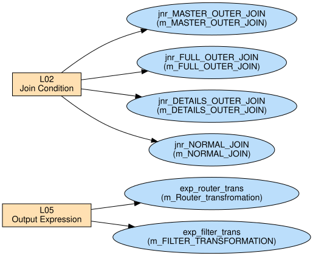

# Duplicate Logic Segments & Usage Graphs

_Auto-generated by `tools/inventory_logic.py`._

Duplicate logic definitions (used in >1 transformation): **2**

## L02 — Join Condition

```
SUBJECT_ID = SUBJECT_ID1
```

Used **4×** across 4 mapping(s):

| Mapping | Transformation | Type | Port/Attr |
|---------|----------------|------|-----------|
| `m_MASTER_OUTER_JOIN` | `jnr_MASTER_OUTER_JOIN` | Joiner | Join Condition |
| `m_FULL_OUTER_JOIN` | `jnr_FULL_OUTER_JOIN` | Joiner | Join Condition |
| `m_DETAILS_OUTER_JOIN` | `jnr_DETAILS_OUTER_JOIN` | Joiner | Join Condition |
| `m_NORMAL_JOIN` | `jnr_NORMAL_JOIN` | Joiner | Join Condition |

## L05 — Output Expression

```
FIRST_NAME || ' ' || LAST_NAME
```

Used **2×** across 2 mapping(s):

| Mapping | Transformation | Type | Port/Attr |
|---------|----------------|------|-----------|
| `m_Router_transfromation` | `exp_router_trans` | Expression | EMP_FULL_NAME |
| `m_FILTER_TRANSFORMATION` | `exp_filter_trans` | Expression | EMP_FULL_NAME |

## Usage graph



