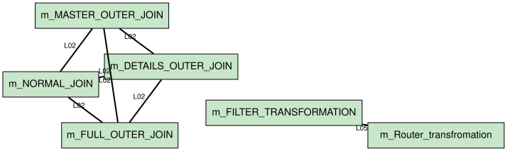

# Merge Analysis: Consolidation Candidates, Merging Graph & Complexity Ranking

_Auto-generated by `tools/inventory_logic.py`._

## Method

A **merge candidate** is a logic definition that occurs in two or more transformations. Merging it means extracting the logic once into a shared/reusable object (a reusable transformation or a mapplet) and referencing it from each mapping.

**Complexity score** estimates the effort/risk of performing the merge:

```
complexity = type_weight
           + (mappings_touched - 1) * 2      # coordination across mappings
           + total_downstream_connectors      # blast radius / re-wiring
           + total_upstream_connectors        # input dependencies to reconnect
```

`type_weight`: Expression=1, Filter=1, Router=2, Source Qualifier=2, Sequence=2, Rank=3, Normalizer=3, Aggregator=3, Joiner=4, Lookup Procedure=4, Custom Transformation=5.

Higher score = harder/riskier merge. Active transforms (Joiner, Lookup, Aggregator) that sit deep in a pipeline score highest.

## Complexity ranking (easiest → hardest to merge)

| Rank | Logic | Category | Type | Occ. | Mappings touched | Upstream | Downstream | Complexity |
|------|-------|----------|------|------|------------------|----------|------------|------------|
| 1 | L05 | Output Expression | Expression | 2 | 2 | 2 | 2 | **7** |
| 2 | L02 | Join Condition | Joiner | 4 | 4 | 8 | 4 | **22** |

### Recommended order of work

1. **L05** (Output Expression, Expression) — complexity **7 [Medium]**. Extract `FIRST_NAME || ' ' || LAST_NAME` into a shared object; update 2 mapping(s): `m_FILTER_TRANSFORMATION`, `m_Router_transfromation`.
2. **L02** (Join Condition, Joiner) — complexity **22 [High]**. Extract `SUBJECT_ID = SUBJECT_ID1` into a shared object; update 4 mapping(s): `m_DETAILS_OUTER_JOIN`, `m_FULL_OUTER_JOIN`, `m_MASTER_OUTER_JOIN`, `m_NORMAL_JOIN`.

## Merging graph

Nodes are mappings; an edge means the two mappings share mergeable logic (edge label lists the shared logic IDs). Clusters of connected mappings are natural candidates for a **single shared mapplet**.



| Mapping A | Mapping B | Shared logic | Merge weight |
|-----------|-----------|--------------|--------------|
| `m_FILTER_TRANSFORMATION` | `m_Router_transfromation` | L05 | 1 |
| `m_DETAILS_OUTER_JOIN` | `m_FULL_OUTER_JOIN` | L02 | 1 |
| `m_DETAILS_OUTER_JOIN` | `m_MASTER_OUTER_JOIN` | L02 | 1 |
| `m_DETAILS_OUTER_JOIN` | `m_NORMAL_JOIN` | L02 | 1 |
| `m_FULL_OUTER_JOIN` | `m_MASTER_OUTER_JOIN` | L02 | 1 |
| `m_FULL_OUTER_JOIN` | `m_NORMAL_JOIN` | L02 | 1 |
| `m_MASTER_OUTER_JOIN` | `m_NORMAL_JOIN` | L02 | 1 |

## Parameterizable logic families (near-duplicates)

These segments are **structurally identical** but differ only by column or constant. They can be merged into a single **parameterized** shared transformation/mapplet (using mapping parameters or a common expression template) rather than copied per mapping.

### Family F1 — Router Group Condition

Template: `ID=NUM`  (3 occurrences, 3 distinct variants)

| Variant | Mapping | Transformation |
|---------|---------|----------------|
| `DEPARTMENT_ID=10` | `m_Router_transfromation` | `rtr_GROUPING_ON_DEPTID` |
| `DEPARTMENT_ID=20` | `m_Router_transfromation` | `rtr_GROUPING_ON_DEPTID` |
| `DEPARTMENT_ID=30` | `m_Router_transfromation` | `rtr_GROUPING_ON_DEPTID` |

### Family F2 — Lookup Condition

Template: `ID = ID`  (2 occurrences, 2 distinct variants)

| Variant | Mapping | Transformation |
|---------|---------|----------------|
| `REGION_ID = in_REGION_ID1` | `m_LOOKUP_TRANSFORMATION` | `lkp_REGION_NAME` |
| `DEPARTMENT_ID = in_DEPARTMENT_ID` | `m_LOOKUP_UNCONNECTED` | `lkp_DEPARTMENT_NAME` |

## Suggested shared-mapplet clusters

- **Cluster 1**: `m_FILTER_TRANSFORMATION`, `m_Router_transfromation` — shared logic L05. Candidate for one common mapplet feeding all listed mappings.
- **Cluster 2**: `m_DETAILS_OUTER_JOIN`, `m_FULL_OUTER_JOIN`, `m_MASTER_OUTER_JOIN`, `m_NORMAL_JOIN` — shared logic L02. Candidate for one common mapplet feeding all listed mappings.

