# Informatica Dependency / Lineage Graph

End-to-end **source → transformation → target** lineage for the *Explore Informatica* repository folder, generated automatically from the PowerCenter metadata exports (`Mapping_ExploreInformatica.XML`, `WorkFlow_ExploreInformatica.XML`).

> Regenerate with `python3 tools/parse_lineage.py`. Mermaid diagrams render natively on GitHub; `docs/lineage/*.dot` can be rendered with Graphviz (`dot -Tpng`/`-Tsvg`).

## 1. Inventory summary

| Object type | Count |
|---|---|
| Source definitions | 7 |
| Target definitions | 13 |
| Mappings | 13 |
| Sessions | 14 |
| Workflows | 14 |
| Transformation instances | 36 |
| Mapplets | 0 (none defined in this folder) |
| Reusable (shared) transformations | 0 (all transformations are mapping-local) |

## 2. Sources

| Source | DB type | Owner | Fields |
|---|---|---|---|
| `EMPLOYEES` | Oracle | HR | 11 |
| `SUBJECTS` | Oracle | HR | 2 |
| `STUDENTS` | Oracle | HR | 2 |
| `EMPLOYEE_INDIA` | Oracle | HR | 4 |
| `EMPLOYEE_DUB` | Oracle | HR | 4 |
| `COUNTRIES` | Oracle | HR | 3 |
| `STUDENTS_SCORE` | Oracle | HR | 4 |

## 3. Targets

| Target | DB type | Fields |
|---|---|---|
| `ORG_EMPLOYEE_DEFAULT` | Oracle | 4 |
| `ORG_EMPLOYEE_DEPT3` | Oracle | 4 |
| `ORG_EMPLOYEE_DEPT2` | Oracle | 4 |
| `ORG_EMPLOYEE_DEPT1` | Oracle | 4 |
| `DEPT_SALARY` | Oracle | 2 |
| `students_rec` | Oracle | 3 |
| `EMPLOYEE_ALL` | Oracle | 4 |
| `COUNTRY_DATA` | Oracle | 4 |
| `STUDENTS_DETAILSHEET` | Oracle | 4 |
| `EMPLOYEE_DEPT` | Oracle | 12 |
| `ORG_EMPLOYEE_DATA` | Oracle | 4 |
| `EMPLOYEE_RANK` | Oracle | 4 |
| `EMPLOYEE_SEQUENCE_NUMBER` | Oracle | 4 |

## 4. Workflow → Session → Mapping execution map

| Workflow | Session (task) | Reusable | Mapping | Sources | Targets |
|---|---|---|---|---|---|
| `wf_ROUTER_TRANS` | `s_ROUTER_TRANS` | YES | `m_Router_transfromation` | EMPLOYEES | ORG_EMPLOYEE_DEPT1, ORG_EMPLOYEE_DEPT2, ORG_EMPLOYEE_DEPT3, ORG_EMPLOYEE_DEFAULT |
| `wf_FILTER_TRANSFORMATION` | `s_FILTER_TRANSFORMATION` | YES | `m_FILTER_TRANSFORMATION` | EMPLOYEES | ORG_EMPLOYEE_DATA |
| `wf_AGGREGATOR_TRANS` | `s_AGGREGATOR_TRANS` | YES | `m_AGGREGATOR_TRANS` | EMPLOYEES | DEPT_SALARY |
| `wf_MASTER_OUTER_JOIN` | `s_MASTER_OUTER_JOIN` | YES | `m_MASTER_OUTER_JOIN` | SUBJECTS, STUDENTS | students_rec |
| `wf_DETAILS_OUTER_JOIN` | `s_DETAILS_OUTER_JOIN` | YES | `m_DETAILS_OUTER_JOIN` | STUDENTS, SUBJECTS | students_rec |
| `wf_FULL_OUTER_JOIN` | `s_FULL_OUTER_JOIN` | NO | `m_FULL_OUTER_JOIN` | SUBJECTS, STUDENTS | students_rec |
| `wf_NORMAL_JOIN` | `s_NORMAL_JOIN` | NO | `m_NORMAL_JOIN` | SUBJECTS, STUDENTS | students_rec |
| `wf_RANK_TRANSFORMATION` | `s_RANK_TRANSFORMATION` | NO | `m_RANK_TRANSFORMATION` | EMPLOYEES | EMPLOYEE_RANK |
| `wf_SEQUENC_TRANSFORMATION` | `s_SEQUENC_TRANSFORMATION` | NO | `m_SEQUENC_TRANSFORMATION` | EMPLOYEES | EMPLOYEE_SEQUENCE_NUMBER |
| `wf_LOOKUP_TRANSFORMATION` | `s_LOOKUP_TRANSFORMATION` | NO | `m_LOOKUP_TRANSFORMATION` | COUNTRIES | COUNTRY_DATA |
| `wf_LOOKUP_UNCONNECTED` | `s_LOOKUP_UNCONNECTED` | NO | `m_LOOKUP_UNCONNECTED` | EMPLOYEES | EMPLOYEE_DEPT |
| `wf_UNION_TRANSFORMATION` | `s_UNION_TRANSFORMATION` | NO | `m_UNION_TRANSFORMATION` | EMPLOYEE_DUB, EMPLOYEE_INDIA | EMPLOYEE_ALL |
| `wf_NORMALIZER_TRANSFORMATION` | `s_NORMALIZER_TRANSFORMATION` | NO | `m_NORMALIZER_TRANSFORMATION` | STUDENTS_SCORE | STUDENTS_DETAILSHEET |
| `wf_CUSTOMERDETAILS` | `s_CUSTOMERDETAILS` | YES | `m_CUSTOMERDETAILS` ⚠️ *(not in export)* |  |  |

> ⚠️ **Cross-reference gap:** the following mapping(s) are referenced by a session but are **not defined** in `Mapping_ExploreInformatica.XML` (defined in another folder/export): `m_CUSTOMERDETAILS`.

### Session database connections

| Session | Connection | Type | Subtype |
|---|---|---|---|
| `s_AGGREGATOR_TRANS` | `Oracle_DEV` | Relational | Oracle |
| `s_CUSTOMERDETAILS` | `Oracle_DEV` | Relational | Oracle |
| `s_DETAILS_OUTER_JOIN` | `Oracle_DEV` | Relational | Oracle |
| `s_FILTER_TRANSFORMATION` | `Oracle_DEV` | Relational | Oracle |
| `s_FULL_OUTER_JOIN` | `Oracle_DEV` | Relational | Oracle |
| `s_LOOKUP_TRANSFORMATION` | `Oracle_DEV` | Relational | Oracle |
| `s_LOOKUP_UNCONNECTED` | `Oracle_DEV` | Relational | Oracle |
| `s_MASTER_OUTER_JOIN` | `Oracle_DEV` | Relational | Oracle |
| `s_NORMALIZER_TRANSFORMATION` | `Oracle_DEV` | Relational | Oracle |
| `s_NORMAL_JOIN` | `Oracle_DEV` | Relational | Oracle |
| `s_RANK_TRANSFORMATION` | `Oracle_DEV` | Relational | Oracle |
| `s_ROUTER_TRANS` | `Oracle_DEV` | Relational | Oracle |
| `s_SEQUENC_TRANSFORMATION` | `Oracle_DEV` | Relational | Oracle |
| `s_UNION_TRANSFORMATION` | `Oracle_DEV` | Relational | Oracle |

## 5. Overall lineage graph

Workflow (green) runs a session that executes a mapping (yellow), which reads sources (blue) and writes targets (red).

Rendered Graphviz overview (also available as [`lineage_overview.svg`](lineage_overview.svg) / [`lineage.dot`](lineage.dot) detailed field-instance version):

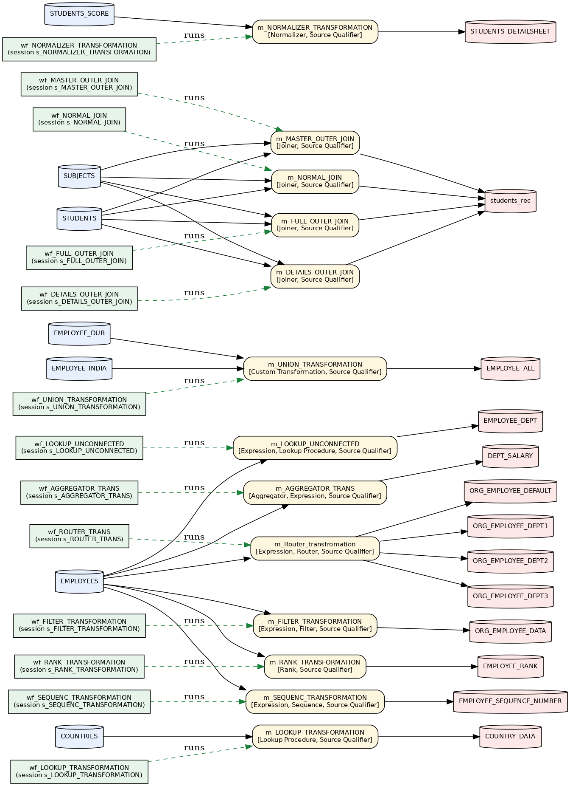

> Note: an **unconnected Lookup** (e.g. `lkp_DEPARTMENT_NAME` in `m_LOOKUP_UNCONNECTED`) appears as an isolated node — it is invoked from an expression via `:LKP`, so it has no pipeline connectors, which is expected.

```mermaid
flowchart LR
    MAP_m_Router_transfromation["m_Router_transfromation<br/><i>Expression, Router, Source Qualifier</i>"]
    WF_wf_ROUTER_TRANS(["wf_ROUTER_TRANS<br/>session s_ROUTER_TRANS"])
    WF_wf_ROUTER_TRANS -. runs .-> MAP_m_Router_transfromation
    SRC_EMPLOYEES[("EMPLOYEES")]
    SRC_EMPLOYEES --> MAP_m_Router_transfromation
    TGT_ORG_EMPLOYEE_DEPT1[("ORG_EMPLOYEE_DEPT1")]
    MAP_m_Router_transfromation --> TGT_ORG_EMPLOYEE_DEPT1
    TGT_ORG_EMPLOYEE_DEPT2[("ORG_EMPLOYEE_DEPT2")]
    MAP_m_Router_transfromation --> TGT_ORG_EMPLOYEE_DEPT2
    TGT_ORG_EMPLOYEE_DEPT3[("ORG_EMPLOYEE_DEPT3")]
    MAP_m_Router_transfromation --> TGT_ORG_EMPLOYEE_DEPT3
    TGT_ORG_EMPLOYEE_DEFAULT[("ORG_EMPLOYEE_DEFAULT")]
    MAP_m_Router_transfromation --> TGT_ORG_EMPLOYEE_DEFAULT
    MAP_m_AGGREGATOR_TRANS["m_AGGREGATOR_TRANS<br/><i>Aggregator, Expression, Source Qualifier</i>"]
    WF_wf_AGGREGATOR_TRANS(["wf_AGGREGATOR_TRANS<br/>session s_AGGREGATOR_TRANS"])
    WF_wf_AGGREGATOR_TRANS -. runs .-> MAP_m_AGGREGATOR_TRANS
    SRC_EMPLOYEES --> MAP_m_AGGREGATOR_TRANS
    TGT_DEPT_SALARY[("DEPT_SALARY")]
    MAP_m_AGGREGATOR_TRANS --> TGT_DEPT_SALARY
    MAP_m_MASTER_OUTER_JOIN["m_MASTER_OUTER_JOIN<br/><i>Joiner, Source Qualifier</i>"]
    WF_wf_MASTER_OUTER_JOIN(["wf_MASTER_OUTER_JOIN<br/>session s_MASTER_OUTER_JOIN"])
    WF_wf_MASTER_OUTER_JOIN -. runs .-> MAP_m_MASTER_OUTER_JOIN
    SRC_SUBJECTS[("SUBJECTS")]
    SRC_SUBJECTS --> MAP_m_MASTER_OUTER_JOIN
    SRC_STUDENTS[("STUDENTS")]
    SRC_STUDENTS --> MAP_m_MASTER_OUTER_JOIN
    TGT_students_rec[("students_rec")]
    MAP_m_MASTER_OUTER_JOIN --> TGT_students_rec
    MAP_m_UNION_TRANSFORMATION["m_UNION_TRANSFORMATION<br/><i>Custom Transformation, Source Qualifier</i>"]
    WF_wf_UNION_TRANSFORMATION(["wf_UNION_TRANSFORMATION<br/>session s_UNION_TRANSFORMATION"])
    WF_wf_UNION_TRANSFORMATION -. runs .-> MAP_m_UNION_TRANSFORMATION
    SRC_EMPLOYEE_DUB[("EMPLOYEE_DUB")]
    SRC_EMPLOYEE_DUB --> MAP_m_UNION_TRANSFORMATION
    SRC_EMPLOYEE_INDIA[("EMPLOYEE_INDIA")]
    SRC_EMPLOYEE_INDIA --> MAP_m_UNION_TRANSFORMATION
    TGT_EMPLOYEE_ALL[("EMPLOYEE_ALL")]
    MAP_m_UNION_TRANSFORMATION --> TGT_EMPLOYEE_ALL
    MAP_m_LOOKUP_TRANSFORMATION["m_LOOKUP_TRANSFORMATION<br/><i>Lookup Procedure, Source Qualifier</i>"]
    WF_wf_LOOKUP_TRANSFORMATION(["wf_LOOKUP_TRANSFORMATION<br/>session s_LOOKUP_TRANSFORMATION"])
    WF_wf_LOOKUP_TRANSFORMATION -. runs .-> MAP_m_LOOKUP_TRANSFORMATION
    SRC_COUNTRIES[("COUNTRIES")]
    SRC_COUNTRIES --> MAP_m_LOOKUP_TRANSFORMATION
    TGT_COUNTRY_DATA[("COUNTRY_DATA")]
    MAP_m_LOOKUP_TRANSFORMATION --> TGT_COUNTRY_DATA
    MAP_m_NORMALIZER_TRANSFORMATION["m_NORMALIZER_TRANSFORMATION<br/><i>Normalizer, Source Qualifier</i>"]
    WF_wf_NORMALIZER_TRANSFORMATION(["wf_NORMALIZER_TRANSFORMATION<br/>session s_NORMALIZER_TRANSFORMATION"])
    WF_wf_NORMALIZER_TRANSFORMATION -. runs .-> MAP_m_NORMALIZER_TRANSFORMATION
    SRC_STUDENTS_SCORE[("STUDENTS_SCORE")]
    SRC_STUDENTS_SCORE --> MAP_m_NORMALIZER_TRANSFORMATION
    TGT_STUDENTS_DETAILSHEET[("STUDENTS_DETAILSHEET")]
    MAP_m_NORMALIZER_TRANSFORMATION --> TGT_STUDENTS_DETAILSHEET
    MAP_m_LOOKUP_UNCONNECTED["m_LOOKUP_UNCONNECTED<br/><i>Expression, Lookup Procedure, Source Qualifier</i>"]
    WF_wf_LOOKUP_UNCONNECTED(["wf_LOOKUP_UNCONNECTED<br/>session s_LOOKUP_UNCONNECTED"])
    WF_wf_LOOKUP_UNCONNECTED -. runs .-> MAP_m_LOOKUP_UNCONNECTED
    SRC_EMPLOYEES --> MAP_m_LOOKUP_UNCONNECTED
    TGT_EMPLOYEE_DEPT[("EMPLOYEE_DEPT")]
    MAP_m_LOOKUP_UNCONNECTED --> TGT_EMPLOYEE_DEPT
    MAP_m_FILTER_TRANSFORMATION["m_FILTER_TRANSFORMATION<br/><i>Expression, Filter, Source Qualifier</i>"]
    WF_wf_FILTER_TRANSFORMATION(["wf_FILTER_TRANSFORMATION<br/>session s_FILTER_TRANSFORMATION"])
    WF_wf_FILTER_TRANSFORMATION -. runs .-> MAP_m_FILTER_TRANSFORMATION
    SRC_EMPLOYEES --> MAP_m_FILTER_TRANSFORMATION
    TGT_ORG_EMPLOYEE_DATA[("ORG_EMPLOYEE_DATA")]
    MAP_m_FILTER_TRANSFORMATION --> TGT_ORG_EMPLOYEE_DATA
    MAP_m_FULL_OUTER_JOIN["m_FULL_OUTER_JOIN<br/><i>Joiner, Source Qualifier</i>"]
    WF_wf_FULL_OUTER_JOIN(["wf_FULL_OUTER_JOIN<br/>session s_FULL_OUTER_JOIN"])
    WF_wf_FULL_OUTER_JOIN -. runs .-> MAP_m_FULL_OUTER_JOIN
    SRC_SUBJECTS --> MAP_m_FULL_OUTER_JOIN
    SRC_STUDENTS --> MAP_m_FULL_OUTER_JOIN
    MAP_m_FULL_OUTER_JOIN --> TGT_students_rec
    MAP_m_DETAILS_OUTER_JOIN["m_DETAILS_OUTER_JOIN<br/><i>Joiner, Source Qualifier</i>"]
    WF_wf_DETAILS_OUTER_JOIN(["wf_DETAILS_OUTER_JOIN<br/>session s_DETAILS_OUTER_JOIN"])
    WF_wf_DETAILS_OUTER_JOIN -. runs .-> MAP_m_DETAILS_OUTER_JOIN
    SRC_STUDENTS --> MAP_m_DETAILS_OUTER_JOIN
    SRC_SUBJECTS --> MAP_m_DETAILS_OUTER_JOIN
    MAP_m_DETAILS_OUTER_JOIN --> TGT_students_rec
    MAP_m_NORMAL_JOIN["m_NORMAL_JOIN<br/><i>Joiner, Source Qualifier</i>"]
    WF_wf_NORMAL_JOIN(["wf_NORMAL_JOIN<br/>session s_NORMAL_JOIN"])
    WF_wf_NORMAL_JOIN -. runs .-> MAP_m_NORMAL_JOIN
    SRC_SUBJECTS --> MAP_m_NORMAL_JOIN
    SRC_STUDENTS --> MAP_m_NORMAL_JOIN
    MAP_m_NORMAL_JOIN --> TGT_students_rec
    MAP_m_RANK_TRANSFORMATION["m_RANK_TRANSFORMATION<br/><i>Rank, Source Qualifier</i>"]
    WF_wf_RANK_TRANSFORMATION(["wf_RANK_TRANSFORMATION<br/>session s_RANK_TRANSFORMATION"])
    WF_wf_RANK_TRANSFORMATION -. runs .-> MAP_m_RANK_TRANSFORMATION
    SRC_EMPLOYEES --> MAP_m_RANK_TRANSFORMATION
    TGT_EMPLOYEE_RANK[("EMPLOYEE_RANK")]
    MAP_m_RANK_TRANSFORMATION --> TGT_EMPLOYEE_RANK
    MAP_m_SEQUENC_TRANSFORMATION["m_SEQUENC_TRANSFORMATION<br/><i>Expression, Sequence, Source Qualifier</i>"]
    WF_wf_SEQUENC_TRANSFORMATION(["wf_SEQUENC_TRANSFORMATION<br/>session s_SEQUENC_TRANSFORMATION"])
    WF_wf_SEQUENC_TRANSFORMATION -. runs .-> MAP_m_SEQUENC_TRANSFORMATION
    SRC_EMPLOYEES --> MAP_m_SEQUENC_TRANSFORMATION
    TGT_EMPLOYEE_SEQUENCE_NUMBER[("EMPLOYEE_SEQUENCE_NUMBER")]
    MAP_m_SEQUENC_TRANSFORMATION --> TGT_EMPLOYEE_SEQUENCE_NUMBER
    classDef src fill:#e8f0fe,stroke:#3367d6;
    classDef tgt fill:#fce8e6,stroke:#c5221f;
    classDef wf fill:#e6f4ea,stroke:#188038;
    class SRC_COUNTRIES SRC_EMPLOYEES SRC_EMPLOYEE_DUB SRC_EMPLOYEE_INDIA SRC_STUDENTS SRC_STUDENTS_SCORE SRC_SUBJECTS src;
    class TGT_COUNTRY_DATA TGT_DEPT_SALARY TGT_EMPLOYEE_ALL TGT_EMPLOYEE_DEPT TGT_EMPLOYEE_RANK TGT_EMPLOYEE_SEQUENCE_NUMBER TGT_ORG_EMPLOYEE_DATA TGT_ORG_EMPLOYEE_DEFAULT TGT_ORG_EMPLOYEE_DEPT1 TGT_ORG_EMPLOYEE_DEPT2 TGT_ORG_EMPLOYEE_DEPT3 TGT_STUDENTS_DETAILSHEET TGT_students_rec tgt;
    class WF_wf_ROUTER_TRANS WF_wf_FILTER_TRANSFORMATION WF_wf_AGGREGATOR_TRANS WF_wf_MASTER_OUTER_JOIN WF_wf_DETAILS_OUTER_JOIN WF_wf_FULL_OUTER_JOIN WF_wf_NORMAL_JOIN WF_wf_RANK_TRANSFORMATION WF_wf_SEQUENC_TRANSFORMATION WF_wf_LOOKUP_TRANSFORMATION WF_wf_LOOKUP_UNCONNECTED WF_wf_UNION_TRANSFORMATION WF_wf_NORMALIZER_TRANSFORMATION WF_wf_CUSTOMERDETAILS wf;
```

## 6. Per-mapping field-flow lineage

### 6.1 `m_Router_transfromation`

- **Sources:** `EMPLOYEES`
- **Targets:** `ORG_EMPLOYEE_DEPT1`, `ORG_EMPLOYEE_DEPT2`, `ORG_EMPLOYEE_DEPT3`, `ORG_EMPLOYEE_DEFAULT`
- **Transformations (3):** `SQ_EMPLOYEES` (Source Qualifier), `exp_router_trans` (Expression), `rtr_GROUPING_ON_DEPTID` (Router)
- **Session(s):** `s_ROUTER_TRANS` (workflow: `wf_ROUTER_TRANS`)
- **Target load order:** 1. `ORG_EMPLOYEE_DEFAULT` → 1. `ORG_EMPLOYEE_DEPT1` → 1. `ORG_EMPLOYEE_DEPT2` → 1. `ORG_EMPLOYEE_DEPT3`

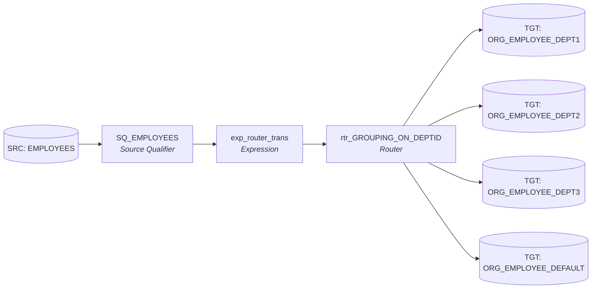

### 6.2 `m_AGGREGATOR_TRANS`

- **Sources:** `EMPLOYEES`
- **Targets:** `DEPT_SALARY`
- **Transformations (3):** `SQ_EMPLOYEES` (Source Qualifier), `exp_AGGREGATOR_TRANS` (Expression), `AGGTRANS` (Aggregator)
- **Session(s):** `s_AGGREGATOR_TRANS` (workflow: `wf_AGGREGATOR_TRANS`)
- **Target load order:** 1. `DEPT_SALARY`

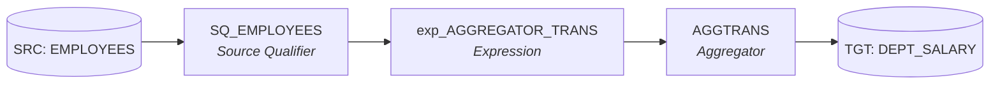

### 6.3 `m_MASTER_OUTER_JOIN`

- **Sources:** `SUBJECTS`, `STUDENTS`
- **Targets:** `students_rec`
- **Transformations (3):** `SQ_SUBJECTS` (Source Qualifier), `SQ_STUDENTS` (Source Qualifier), `jnr_MASTER_OUTER_JOIN` (Joiner)
- **Session(s):** `s_MASTER_OUTER_JOIN` (workflow: `wf_MASTER_OUTER_JOIN`)
- **Target load order:** 1. `students_rec`

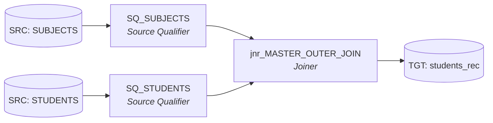

### 6.4 `m_UNION_TRANSFORMATION`

- **Sources:** `EMPLOYEE_DUB`, `EMPLOYEE_INDIA`
- **Targets:** `EMPLOYEE_ALL`
- **Transformations (3):** `SQ_EMPLOYEE_DUB` (Source Qualifier), `SQ_EMPLOYEE_INDIA` (Source Qualifier), `Union_EMPLOYEE_ALL` (Custom Transformation)
- **Session(s):** `s_UNION_TRANSFORMATION` (workflow: `wf_UNION_TRANSFORMATION`)
- **Target load order:** 1. `EMPLOYEE_ALL`

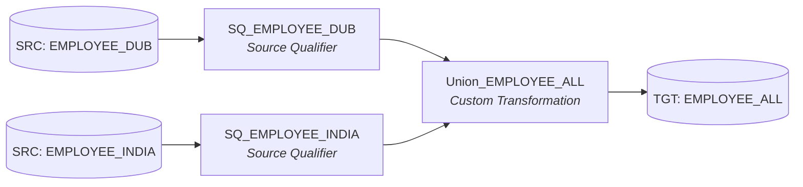

### 6.5 `m_LOOKUP_TRANSFORMATION`

- **Sources:** `COUNTRIES`
- **Targets:** `COUNTRY_DATA`
- **Transformations (2):** `SQ_COUNTRIES` (Source Qualifier), `lkp_REGION_NAME` (Lookup Procedure)
- **Session(s):** `s_LOOKUP_TRANSFORMATION` (workflow: `wf_LOOKUP_TRANSFORMATION`)
- **Target load order:** 1. `COUNTRY_DATA`

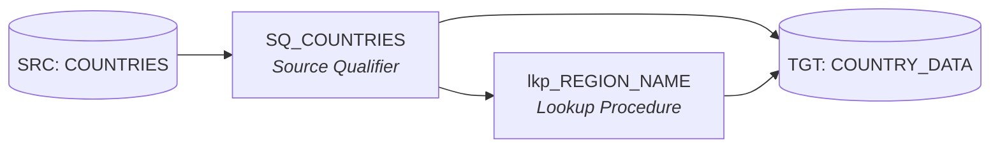

### 6.6 `m_NORMALIZER_TRANSFORMATION`

- **Sources:** `STUDENTS_SCORE`
- **Targets:** `STUDENTS_DETAILSHEET`
- **Transformations (2):** `SQ_STUDENTS_SCORE` (Source Qualifier), `nrm_STUDENT_SCORE` (Normalizer)
- **Session(s):** `s_NORMALIZER_TRANSFORMATION` (workflow: `wf_NORMALIZER_TRANSFORMATION`)
- **Target load order:** 1. `STUDENTS_DETAILSHEET`

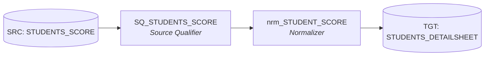

### 6.7 `m_LOOKUP_UNCONNECTED`

- **Sources:** `EMPLOYEES`
- **Targets:** `EMPLOYEE_DEPT`
- **Transformations (3):** `SQ_EMPLOYEES` (Source Qualifier), `lkp_DEPARTMENT_NAME` (Lookup Procedure), `exp_ikr_department_name` (Expression)
- **Session(s):** `s_LOOKUP_UNCONNECTED` (workflow: `wf_LOOKUP_UNCONNECTED`)
- **Target load order:** 1. `EMPLOYEE_DEPT`

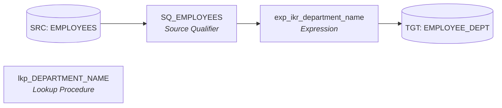

### 6.8 `m_FILTER_TRANSFORMATION`

- **Sources:** `EMPLOYEES`
- **Targets:** `ORG_EMPLOYEE_DATA`
- **Transformations (3):** `SQ_EMPLOYEES` (Source Qualifier), `exp_filter_trans` (Expression), `fltr_Filter_transformation` (Filter)
- **Session(s):** `s_FILTER_TRANSFORMATION` (workflow: `wf_FILTER_TRANSFORMATION`)
- **Target load order:** 1. `ORG_EMPLOYEE_DATA`

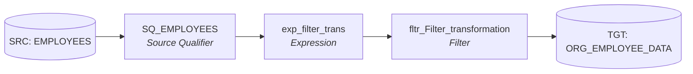

### 6.9 `m_FULL_OUTER_JOIN`

- **Sources:** `SUBJECTS`, `STUDENTS`
- **Targets:** `students_rec`
- **Transformations (3):** `SQ_SUBJECTS` (Source Qualifier), `SQ_STUDENTS` (Source Qualifier), `jnr_FULL_OUTER_JOIN` (Joiner)
- **Session(s):** `s_FULL_OUTER_JOIN` (workflow: `wf_FULL_OUTER_JOIN`)
- **Target load order:** 1. `students_rec`

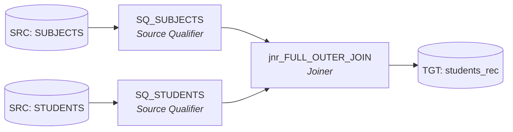

### 6.10 `m_DETAILS_OUTER_JOIN`

- **Sources:** `STUDENTS`, `SUBJECTS`
- **Targets:** `students_rec`
- **Transformations (3):** `SQ_SUBJECTS` (Source Qualifier), `SQ_STUDENTS` (Source Qualifier), `jnr_DETAILS_OUTER_JOIN` (Joiner)
- **Session(s):** `s_DETAILS_OUTER_JOIN` (workflow: `wf_DETAILS_OUTER_JOIN`)
- **Target load order:** 1. `students_rec`

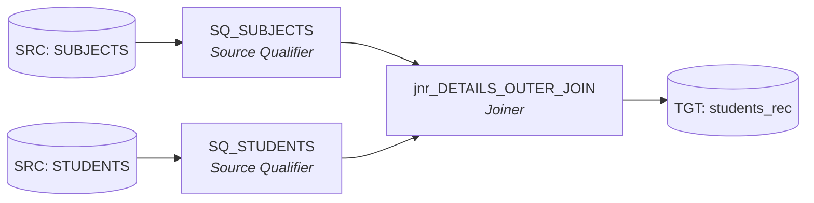

### 6.11 `m_NORMAL_JOIN`

- **Sources:** `SUBJECTS`, `STUDENTS`
- **Targets:** `students_rec`
- **Transformations (3):** `SQ_SUBJECTS` (Source Qualifier), `SQ_STUDENTS` (Source Qualifier), `jnr_NORMAL_JOIN` (Joiner)
- **Session(s):** `s_NORMAL_JOIN` (workflow: `wf_NORMAL_JOIN`)
- **Target load order:** 1. `students_rec`

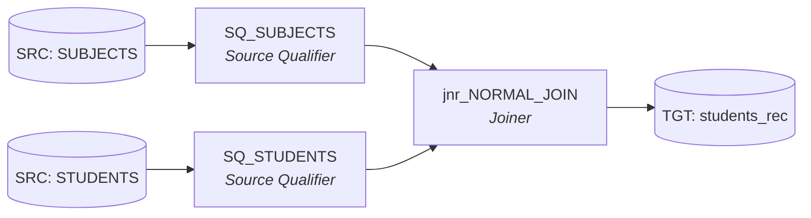

### 6.12 `m_RANK_TRANSFORMATION`

- **Sources:** `EMPLOYEES`
- **Targets:** `EMPLOYEE_RANK`
- **Transformations (2):** `SQ_EMPLOYEES` (Source Qualifier), `rnk_BOTTOM_SALARY` (Rank)
- **Session(s):** `s_RANK_TRANSFORMATION` (workflow: `wf_RANK_TRANSFORMATION`)
- **Target load order:** 1. `EMPLOYEE_RANK`

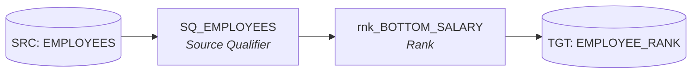

### 6.13 `m_SEQUENC_TRANSFORMATION`

- **Sources:** `EMPLOYEES`
- **Targets:** `EMPLOYEE_SEQUENCE_NUMBER`
- **Transformations (3):** `SQ_EMPLOYEES` (Source Qualifier), `exp_SEQUENCE_TRANS` (Expression), `seq_SERIAL_NUMBER` (Sequence)
- **Session(s):** `s_SEQUENC_TRANSFORMATION` (workflow: `wf_SEQUENC_TRANSFORMATION`)
- **Target load order:** 1. `EMPLOYEE_SEQUENCE_NUMBER`

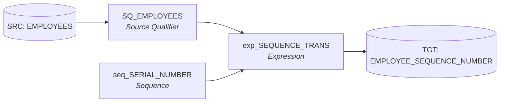

