# Workflow / Session Task-Dependency Graph

Task-level orchestration for every workflow in the *Explore Informatica* folder, generated from `WorkFlow_ExploreInformatica.XML` by `tools/parse_lineage.py`.

Each workflow starts at the built-in **Start** task and links to its **Session** task via a conditional `WORKFLOWLINK`. The session then runs a mapping (see [`DEPENDENCY_LINEAGE.md`](DEPENDENCY_LINEAGE.md) for the data lineage).

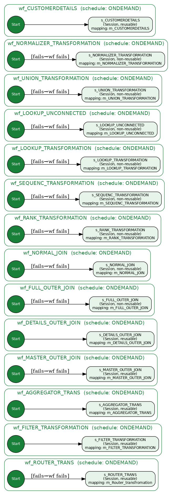

## 1. Summary

- **Workflows:** 14
- **Task instances:** 28 (each workflow = 1 `Start` + 1 `Session`)
- **Task links (WORKFLOWLINK):** 14
- **Non-`Start`/`Session` task types** (Command, Decision, Timer, Control, Assignment, Event, Worklet): **none**
- **Schedule type:** all `ONDEMAND` (run manually / on demand)

> All links are **unconditional** (empty `CONDITION`), so each session runs whenever its workflow starts. Every workflow is an independent, single-session pipeline — there are no cross-workflow task dependencies in this folder.

## 2. Workflow → task links

| Workflow | Schedule | Link | Condition | Session reusable | Fail wf if session fails | Fail wf if session skipped |
|---|---|---|---|---|---|---|
| `wf_ROUTER_TRANS` | ONDEMAND | `Start` → `s_ROUTER_TRANS` | *(none)* | YES | YES | NO |
| `wf_FILTER_TRANSFORMATION` | ONDEMAND | `Start` → `s_FILTER_TRANSFORMATION` | *(none)* | YES | NO | NO |
| `wf_AGGREGATOR_TRANS` | ONDEMAND | `Start` → `s_AGGREGATOR_TRANS` | *(none)* | YES | NO | NO |
| `wf_MASTER_OUTER_JOIN` | ONDEMAND | `Start` → `s_MASTER_OUTER_JOIN` | *(none)* | YES | YES | YES |
| `wf_DETAILS_OUTER_JOIN` | ONDEMAND | `Start` → `s_DETAILS_OUTER_JOIN` | *(none)* | YES | NO | NO |
| `wf_FULL_OUTER_JOIN` | ONDEMAND | `Start` → `s_FULL_OUTER_JOIN` | *(none)* | NO | YES | NO |
| `wf_NORMAL_JOIN` | ONDEMAND | `Start` → `s_NORMAL_JOIN` | *(none)* | NO | YES | YES |
| `wf_RANK_TRANSFORMATION` | ONDEMAND | `Start` → `s_RANK_TRANSFORMATION` | *(none)* | NO | YES | NO |
| `wf_SEQUENC_TRANSFORMATION` | ONDEMAND | `Start` → `s_SEQUENC_TRANSFORMATION` | *(none)* | NO | YES | NO |
| `wf_LOOKUP_TRANSFORMATION` | ONDEMAND | `Start` → `s_LOOKUP_TRANSFORMATION` | *(none)* | NO | YES | YES |
| `wf_LOOKUP_UNCONNECTED` | ONDEMAND | `Start` → `s_LOOKUP_UNCONNECTED` | *(none)* | NO | YES | YES |
| `wf_UNION_TRANSFORMATION` | ONDEMAND | `Start` → `s_UNION_TRANSFORMATION` | *(none)* | NO | YES | YES |
| `wf_NORMALIZER_TRANSFORMATION` | ONDEMAND | `Start` → `s_NORMALIZER_TRANSFORMATION` | *(none)* | NO | YES | YES |
| `wf_CUSTOMERDETAILS` | ONDEMAND | `Start` → `s_CUSTOMERDETAILS` | *(none)* | YES | NO | NO |

## 3. Session target-load behaviour

From each session's writer extensions (truncate-before-load and load type per target).

| Session | Target | Load type | Truncate target |
|---|---|---|---|
| `s_ROUTER_TRANS` | `ORG_EMPLOYEE_DEPT1` | Normal | YES |
| `s_ROUTER_TRANS` | `ORG_EMPLOYEE_DEPT2` | Normal | YES |
| `s_ROUTER_TRANS` | `ORG_EMPLOYEE_DEPT3` | Normal | YES |
| `s_ROUTER_TRANS` | `ORG_EMPLOYEE_DEFAULT` | Normal | YES |
| `s_FILTER_TRANSFORMATION` | `ORG_EMPLOYEE_DATA` | Normal | YES |
| `s_AGGREGATOR_TRANS` | `DEPT_SALARY` | Normal | YES |
| `s_MASTER_OUTER_JOIN` | `students_rec` | Normal | YES |
| `s_DETAILS_OUTER_JOIN` | `students_rec` | Normal | YES |
| `s_FULL_OUTER_JOIN` | `students_rec` | Normal | YES |
| `s_NORMAL_JOIN` | `students_rec` | Normal | YES |
| `s_RANK_TRANSFORMATION` | `EMPLOYEE_RANK` | Normal | YES |
| `s_SEQUENC_TRANSFORMATION` | `EMPLOYEE_SEQUENCE_NUMBER` | Normal | YES |
| `s_LOOKUP_TRANSFORMATION` | `COUNTRY_DATA` | Normal | YES |
| `s_LOOKUP_UNCONNECTED` | `EMPLOYEE_DEPT` | Normal | YES |
| `s_UNION_TRANSFORMATION` | `EMPLOYEE_ALL` | Normal | YES |
| `s_NORMALIZER_TRANSFORMATION` | `STUDENTS_DETAILSHEET` | Normal | YES |
| `s_CUSTOMERDETAILS` | `CUSTOMERDETAILS` | Normal | NO |

## 4. Per-workflow task flow

### `wf_ROUTER_TRANS`

- Schedule: `ONDEMAND` · Valid: YES · Enabled: YES · Suspend on error: NO
- Runs mapping: `m_Router_transfromation`

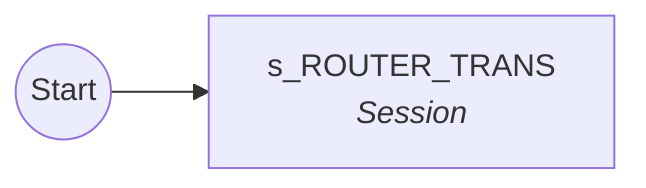

### `wf_FILTER_TRANSFORMATION`

- Schedule: `ONDEMAND` · Valid: YES · Enabled: YES · Suspend on error: NO
- Runs mapping: `m_FILTER_TRANSFORMATION`

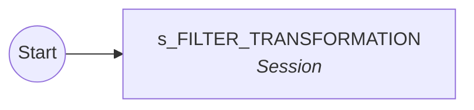

### `wf_AGGREGATOR_TRANS`

- Schedule: `ONDEMAND` · Valid: YES · Enabled: YES · Suspend on error: NO
- Runs mapping: `m_AGGREGATOR_TRANS`

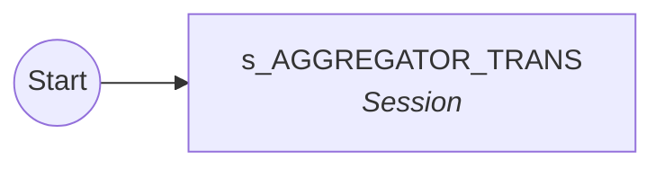

### `wf_MASTER_OUTER_JOIN`

- Schedule: `ONDEMAND` · Valid: YES · Enabled: YES · Suspend on error: NO
- Runs mapping: `m_MASTER_OUTER_JOIN`

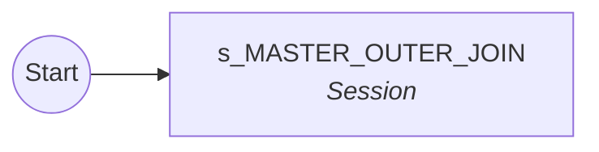

### `wf_DETAILS_OUTER_JOIN`

- Schedule: `ONDEMAND` · Valid: YES · Enabled: YES · Suspend on error: NO
- Runs mapping: `m_DETAILS_OUTER_JOIN`

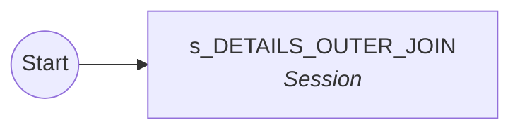

### `wf_FULL_OUTER_JOIN`

- Schedule: `ONDEMAND` · Valid: YES · Enabled: YES · Suspend on error: NO
- Runs mapping: `m_FULL_OUTER_JOIN`

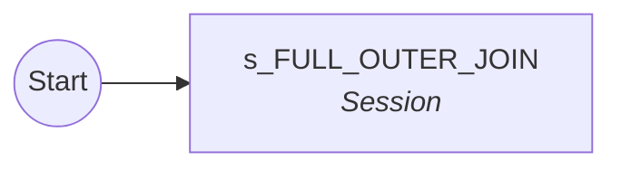

### `wf_NORMAL_JOIN`

- Schedule: `ONDEMAND` · Valid: YES · Enabled: YES · Suspend on error: NO
- Runs mapping: `m_NORMAL_JOIN`

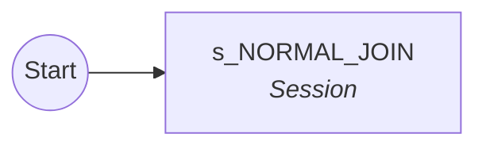

### `wf_RANK_TRANSFORMATION`

- Schedule: `ONDEMAND` · Valid: YES · Enabled: YES · Suspend on error: NO
- Runs mapping: `m_RANK_TRANSFORMATION`

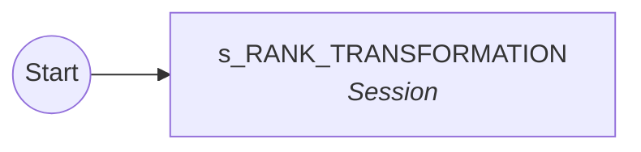

### `wf_SEQUENC_TRANSFORMATION`

- Schedule: `ONDEMAND` · Valid: YES · Enabled: YES · Suspend on error: NO
- Runs mapping: `m_SEQUENC_TRANSFORMATION`

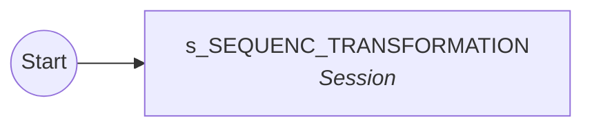

### `wf_LOOKUP_TRANSFORMATION`

- Schedule: `ONDEMAND` · Valid: YES · Enabled: YES · Suspend on error: NO
- Runs mapping: `m_LOOKUP_TRANSFORMATION`

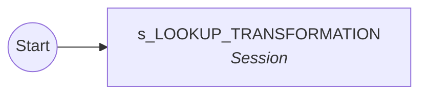

### `wf_LOOKUP_UNCONNECTED`

- Schedule: `ONDEMAND` · Valid: YES · Enabled: YES · Suspend on error: NO
- Runs mapping: `m_LOOKUP_UNCONNECTED`

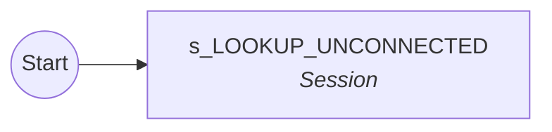

### `wf_UNION_TRANSFORMATION`

- Schedule: `ONDEMAND` · Valid: YES · Enabled: YES · Suspend on error: NO
- Runs mapping: `m_UNION_TRANSFORMATION`

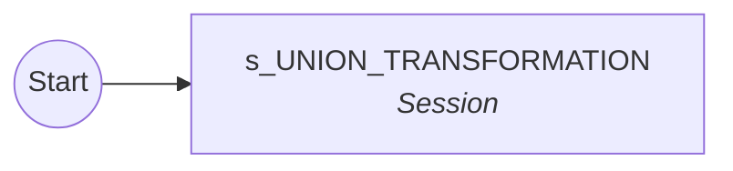

### `wf_NORMALIZER_TRANSFORMATION`

- Schedule: `ONDEMAND` · Valid: YES · Enabled: YES · Suspend on error: NO
- Runs mapping: `m_NORMALIZER_TRANSFORMATION`

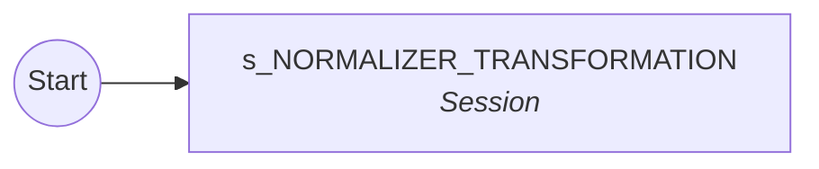

### `wf_CUSTOMERDETAILS`

- Schedule: `ONDEMAND` · Valid: YES · Enabled: YES · Suspend on error: NO
- Runs mapping: `m_CUSTOMERDETAILS` ⚠️ *(mapping not in export)*

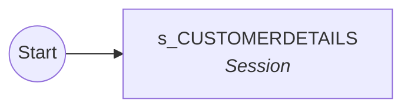

